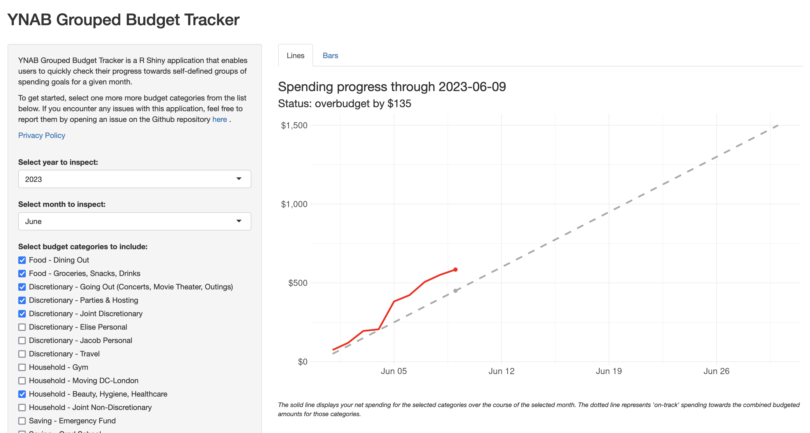
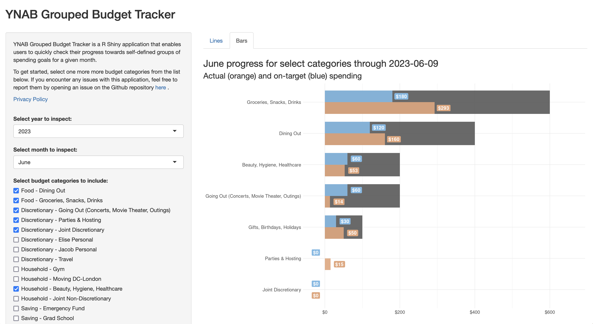

# ynab-group-tracker

## Introduction

Consider a scenario: by the eighth day of the month, you've spent \$112 on food and \$55 on gas. If you have a goal of keeping your combined food and gas spending to $700 for the month, are you on track? How close are you?

Using the YNAB app alone, it can be difficult to identify exactly whether you're on track to meet your monthly spending goals for a single budget category—and it's even more difficult to do so for a group of spending goals or your total spending overall.

YNAB Grouped Budget Tracker is a R Shiny application that enables users to quickly check their progress towards self-defined groups of spending goals for a given month.

## Usage

The app is hosted [here](https://jacobeliason.shinyapps.io/ynab-group-tracker). To use it, you'll need to log in with your YNAB credentials. The app will then pull in your budget data and display it as seen in the screenshots below.

**Monthly progress**

**Category progress**

## Attribution

This app is built using the [R Shiny](https://shiny.rstudio.com/) framework using the [YNAB API](https://api.youneedabudget.com/). It is not affiliated with YNAB.

## Feedback

Feedback and suggestions are welcome! Please open an issue or submit a pull request.

## License

